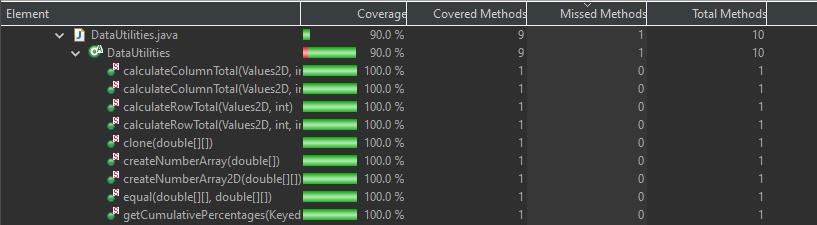
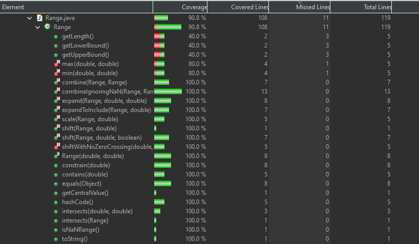

**SENG 438 - Software Testing, Reliability, and Quality**

**Lab. Report #3 – Code Coverage, Adequacy Criteria and Test Case Correlation**

| Group \#:      |  25   |
| -------------- | --- |
| Student Names: | Sahil Bhatt    |
|                | Harshal Patel   |
|                | Siwon Kim    |
|                | Abhiraam Manchiraju    |

(Note that some labs require individual reports while others require one report
for each group. Please see each lab document for details.)

# 1 Introduction

In this lab we will once again be performing unit testing using JUnit in Eclipse. However, contrasting the previous assignment, we will be utilizing white-box coverage criteria testing, rather than blackbox testing. The same system, JFreeChart, will be the system under test.

The objective of this lab is to be introduced to white-box suite testing, and determining its adequacy based on the coverage of the code. We will learn how to measure test adequacy, design test cases to improve code coverage, understand the pros and cons of using code coverage tools to measure test adequacy, and understand how data-flow coverage works.

# 2 Manual data-flow coverage calculations for X and Y methods

## **calculateColumnTotal()**

### **Data Flow Diagram**

### **Def-Use Sets**

|Statement(Node) | def(n)           | c-use(n)       | p-use(n)    | 
|----------------|------------------|----------------|-------------|
|1               |{data,column}     |{}              |{data}       |
|2               |{total,rowCount,r}|{}              |{data}       | 
|3               |{}                |{}              |{r,rowCount} | 
|4               |{n}               |{r,data,column} |{n}          | 
|5               |{total}           |{total,n}       |{}           |
|6               |{r}               |{r}             |{}           | 
|7               |{r2}              |{}              |{}           | 
|8               |{}                |{}              |{r2,rowCount}|
|9               |{n}               |{r2,data,column}|{n}          |
|10              |{total}           |{total,n}       |{}           |
|11              |{r2}              |{r2}            |{}           |
|12              |{}                |{total}         |{}           |

### **DU Pairs Per Variable**
- data: (1,1) (1,2) (1,4) (1,9)

- column: (1,4) (1,9)

- total: (2,5) (2,10) (2,12)

- r: (2,3) (2,4) (2,6) (6,3)

- rowCount: (2,3) (2,8)

- n: (4,4) (4,5) (9,9) (9,10)

- r2: (7,8), (7,9) (7,11) (11,8)

### **DU Pairs Covered per Test**
- calculateColumnTotalForPositiveNumbers() ->  (1,1) (1,2) (1,4,data) (1,4,column) (2,5) (2,12) (2,3,r) (2,3,rowCount) (2,4) (2,6) (6,3) (4,4) (4,5) (2,8) (7,8)

- calculateColumnTotalForNegativeNumbers() -> (1,1) (1,2) (1,4,data) (1,4,column) (2,5) (2,12) (2,3,r) (2,3,rowCount) (2,4) (2,6) (6,3) (4,4) (4,5) (2,8) (7,8)

- calculateColumnTotalForNegativeAndPositiveNumbers() -> (1,1) (1,2) (1,4,data) (1,4,column) (2,5) (2,12) (2,3,r) (2,3,rowCount) (2,4) (2,6) (6,3) (4,4) (4,5) (2,8) (7,8)

- calculateColumnTotalForFourRows() -> (1,1) (1,2) (1,4,data) (1,4,column) (2,5) (2,12) (2,3,r) (2,3,rowCount) (2,4) (2,6) (6,3) (4,4) (4,5) (2,8) (7,8)

### **DU Pair Coverage**

Coverage = DU Pairs Covered / (Total DU Pairs - Infeasible DU Pairs) * 100%

Coverage = 15 / (23 - 8) * 100% = 100%

    

## **contains()**

### **Data Flow Diagram**

### **Def-Use Sets**

|Statement(Node) | def(n)           | c-use(n)       | p-use(n)    | 
|----------------|------------------|----------------|-------------|
|1               |{value}           |{}              |{value}      |
|2               |{}                |{}              |{value}      | 
|3               |{}                |{}              |{value}      | 

### **DU Pairs Per Variable**
- value: (1,1) (1,2) (1,3)

### **DU Pairs Covered per Test**
- containsWithinBounds() -> (1,1) (1,2) (1,3)

- containsOutOfLowerBound() -> (1,1)

- containsOutOfUpperBound() -> (1,1) (1,2)

- containsAtLowerBound() -> (1,1) (1,2) (1,3)

- containsAtUpperBound() -> (1,1) (1,2) (1,3)

### **DU Pair Coverage**

Coverage = DU Pairs Covered / (Total DU Pairs - Infeasible DU Pairs) * 100%

Coverage = 3 / (3 - 0) * 100% = 100%

# 3 A detailed description of the testing strategy for the new unit test

Text…

# 4 A high level description of five selected test cases you have designed using coverage information, and how they have increased code coverage

Text…

# 5 A detailed report of the coverage achieved of each class and method (a screen shot from the code cover results in green and red color would suffice)

## **Initial Coverage**
**DataUtilities.java**
- Line: 45.8%
- Branch: 29.7%
- Method: 50%

**Range.java**
- Line: 32.8%
- Branch: 34.1%
- Method: 43.5%

## **Final Coverage**
**DataUtilities.java**

Line Coverage

Branch Coverage

Method Coverage

    

**Range.java**

Line Coverage

Branch Coverage

Method Coverage

**Note** 

For DataUtilities.java, we were not able to achieve 90% line coverage and instead achieved 88.5%. This is due to sections of code in several methods that were unreachable/unfeasible. Some of examples of this include calculateColumnTotal(Values2D data, int column), calculateRowTotal(Values2D data, int row) and getCumulativePercentages(KeyedValues data) where both of these methods had an extra for loop that was simply unreachable. 

# 6 Pros and Cons of coverage tools used and Metrics you report

For our testing tool we chose to use EcLEmma to track the amount of code that was covered. The reason that we chose EclEmma was because it was a tool that integrated with Eclipse, and setting it up was very easy. The tool was also easy to run, and similar to how we would use junit, where we would simply run the file using the EclEmma tool. Once the tool was run, we would see the percentage of code that would be covered from the tests. There were different types of coverage you could also toggle, which included, instruction, method, line, branch, method, type, complexity. This was helpful to see the coverage depending on these factors. We also were able to see the coverage of different method in a particular class which was helpful when increasing coverage for that method. Eclemma has great user friendliness, due to the simplicity of it. The tool also did not crash. One disadvantage of the tool was that it provides the coverage of the test file itself along with the class. This was a little confusing when determining what the coverage was as we got two different percentages of coverages. Another disadvantage is the documentation, as it would’ve been helpful if there was better documentation of the tool. Some of the features we had to spend time to figure out. 

# 7 A comparison on the advantages and disadvantages of requirements-based test generation and coverage-based test generation.

Requirement-based test involves using a black-box testing methodology where the tester will create tests based on the documentation provided. This allows the tester to envision the program’s expected usage, and design a test suite accordingly, ensuring that the main functionalities of the program function as desired.. However, the downside to this is that there may be some functionality of the program that is missed. 

In this lab, we utilized EclEmma, the built-in coverage tool for Eclipse. Using coverage-based testing was very useful, as it provides the developer with information on different methods and branches, allowing them to see where additional testing is needed. However, a tradeoff of coverage-based testing is that it focuses mostly on the code, and not on the requirements of the program. This could cause situations where the code coverage is high, but all the requirements are not met.

# 8 A discussion on how the team work/effort was divided and managed

For the division of labor in this lab, we split the work into different kinds of testing. Siwon and Abhiraam focused on utilizing line testing. Meanwhile, Harshal performed most of the branch testing, while Sahil was responsible for individual method testing.While each of the members had different roles, we still made sure to work together if anyone needed help. After everyone was done with their part of testing, we went through each of our test cases and made sure that they made sense. If there were any test cases a group member thought was missing, then a group member would suggest a test case to add. 

# 9 Any difficulties encountered, challenges overcome, and lessons learned from performing the lab

Once again, similar to previous labs, we had trouble understanding and deciphering the instructions. However, unlike previous labs, we learned our lesson and started working on the lab earlier, giving us more time to try to interpret the instructions, and allowed us to finish the lab without a time crunch. 

We also had varying results in our coverage tests over the different devices, which we fixed by switching tools. Good communication was key to solving this issue, as it would prevent greater issues in our future tests.

# 10 Comments/feedback on the lab itself

Using different testing methodologies on the same application was a great way for us to learn black box and white box testing . However, instructions were very unclear, and dependencies were missing from the assignment file. It would be nice if there was a video tutorial that set up the testing environment, which would clear up confusion that many groups encounter. Additionally, setting up schedules for lab presentations would be better so groups don’t have to wait for a TA to visit them. 

